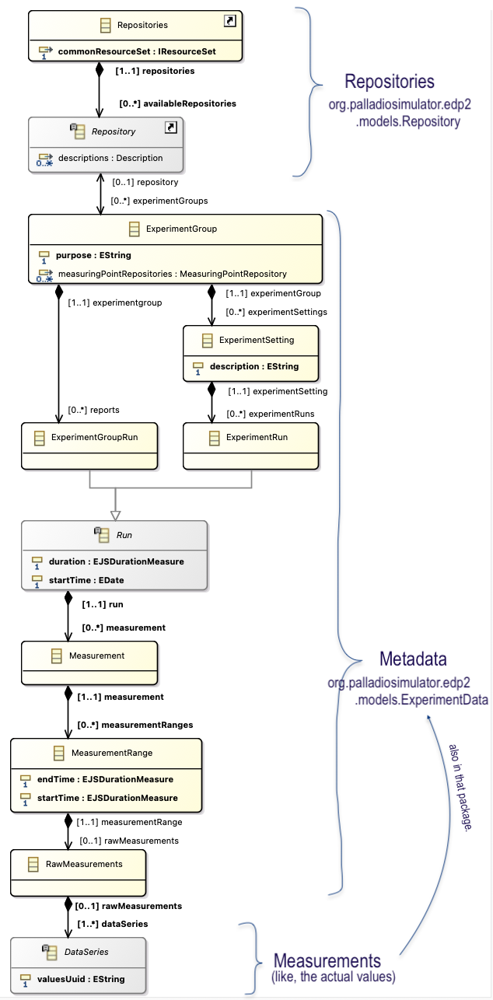
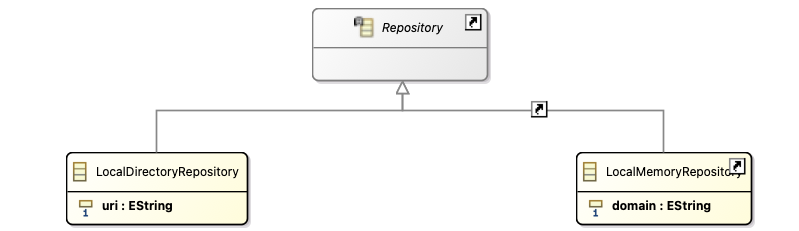
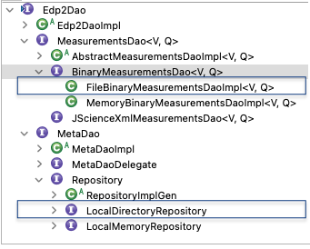

# (Another) Tutorial on how to EDP2

Most of the general information on EDP2 is also described in [description_de.pdf](https://github.com/PalladioSimulator/Palladio-QuAL-EDP2/blob/master/bundles/org.palladiosimulator.edp2.examples/doc/description_de.pdf).
This document recaps parts of that information and continues on with a detailed explanation on what happens in the [`LoadFromFileExample`](https://github.com/PalladioSimulator/Palladio-QuAL-EDP2/blob/additionalExample/bundles/org.palladiosimulator.edp2.examples/src/org/palladiosimulator/edp2/example/LoadFromFileExample.java).

**Disclaimer:** This document was written in 2023. If anyone reads this in like... *years*, beware this document might be outdated. 

## EDP2 metamodel(s)

At first, let's take a look at the EDP2 meta models, located here:
* Data and Repository : https://github.com/PalladioSimulator/Palladio-QuAL-EDP2/tree/master/bundles/org.palladiosimulator.edp2/model
* Local Directory Repository : https://github.com/PalladioSimulator/Palladio-QuAL-EDP2/tree/master/bundles/org.palladiosimulator.edp2.repository.local/model (we wont question why this one got a separate model.)

I created a stripped down view of the meta model, see below.
The view omits details about `DataSeries` and `Repository`, the `MeasuringType` and most classes related to Aggregation.

As marked in the pictures, the EDP2 meta model consists of three parts, namely *Repositories*, *Metadata*, and *Measurements* (as in, the actual measured values).

Now there are two things to keep in mind:
1. Each part is persisted differently
2. You need a DAO to get access to metadata and measurements.



## Persistence 
The *repositories* part, i.e. instances of `Repositories` and `Repository` are not persisted at all. 
The *metadata* part is persisted as XML as most other Palladio models.
The file extension is `.edp2`.
The *measurements* part is persisted in binary format, each series in a different file with the file extension `.edp2bin`.

In case you got some persisted EDP2 files lying around, you'll notice that file names of the binary files match the `valuesUuid` of their respective data series.

E.g. for the two data series listed below, you'll also find two binary files names `_WeMRgaiKEe2Lkfj_a47UkA.edp2bin` and `_WeMRgKiKEe2Lkfj_a47UkA.edp2bin`.
```
<dataSeries xsi:type="org.palladiosimulator.edp2.models:DoubleBinaryMeasurements" valuesUuid="_WeMRgKiKEe2Lkfj_a47UkA" storageUnit=.../>
<dataSeries xsi:type="org.palladiosimulator.edp2.models:DoubleBinaryMeasurements" valuesUuid="_WeMRgaiKEe2Lkfj_a47UkA" storageUnit=.../>
```

## Repository Types
In fact, there are different types of `Repository`s (see class diagramm below )and the entire talk about persistences (c.f. previous section) applies to `LocalDirectoryRepository` only.
`LocalMemoryRepository` is runtime only.
Rumor has it, there are other types of Repository as well, but i could not find them.

Whether you get a directory repository or a memory repository depends on what kind of data source you select in the *Run Configurations...* dialog.
Selecting *In-Memory data source* results in a `LocalMemoryRepository` and selecting *File data source* results in a `LocalDirectoryRepository`. 
(Actually kind of obvious...) 




## Data Access (for persisted EDP2 data)
This section is split into part (A), (B) and (C).
The (A) cover the repositories, (B) the metadata and measurements and (C) some things about dependencies on other models.
I recommend to read all parts before trying to execute anything.

Our goal is to read EDP2 data from file, thus we'll work with a `LocalDirectoryRepository`. 
Working with EDP2 data in memory might differ (similarities exist though).

Throughout both parts, you'll encounter enumerated code snippets. 
If you puzzle the together, and fill the blanks you kind of get the code from `LoadFromFileExample`.
If any code snippet does not work, it is probably a copy error on my part. 
Try to find the pendant in `LoadFromFileExample` und use that instead.

### (A) Repositories
At top of the hierarchy is the *repositories* part. 
As they are not persisted, you must create them yourself. 

1. get a `Repository` instance via the respective factory:
  ```
  LocalDirectoryRepository repo = localFactory.eINSTANCE.createLocalDirectoryRepository();
  ```
  FYI : `localFactory` is in fact a class, despite starting with a lower case character.

2. set the `Repository` instance's URI to the directory containing the EDP2 files
    ```
    repo.setUri(<URI of directory with EDP2 files>);
    ```
3. get a `Repositories` instance from the Manager, and add the `Repository` instance. 
    ```
    Repositories repos = RepositoryManager.getCentralRepository();
    RepositoryManager.addRepository(repos, repo);
    ```

### (B) DAOs
For anything else, i.e. the *metadata* and the *measurements* part, you need DAOs. 
There are a different DAOs, the class hierarchy is depicted below. 
I marked the DAOs we're going to use, respectively already used.  



But first, some general insight into DAOs.
The `Edp2Dao` API defines - among others - the operations `open` and `close`. 
The workflow is like this: get yourself some DAO $\rightarrow$ open the DAO $\rightarrow$ get what ever data you need $\rightarrow$ once you're done, close the DAO. 

Now there are two types of DAOs, `MeasurementsDao` and `MetaDao`. 
The former is for accessing the *measurements* part, and the latter for accessing the *metadata* part. 

Conveniently, the `Repository` from the previous section is also a DAO, and if you check the documentation of the `RepositoryManager`'s `addRepository` method, you'll notice that when adding a repository, it is automatically opened.
Thus, after step 3. of the previous section, you already have the DAO to access the *metadata* part.

4. access *metadata* part:
    ```
    List<ExperimentGroup> groups = repo.getExperimentGroups();
    ```

Now you gotta dig through the metadata, until you find a data series. 
To access values of the series - i.e. the *measurments* part - you need an instance of `MeasurementsDao`. 
As you are trying to read values from a binary file, an instance of `FileBinaryMeasurementsDao` would be preferable.
You do not yet have one, thus you must create it.  

5. create a DAO for the *measurements* part and open it:

    ```
    DataSeries series = ...;
    MeasurementsDaoFactory factory = repo.getMeasurementsDaoFactory();
    MeasurementsDao<Double, Duration> dao = factory.createDoubleMeasurementsDao(series.getValuesUuid(), SI.SECOND);

    dao.open();
    ```
* alternatively you can also use the `MeasurementsUtility` to create the DAO:
 
    ```
    MeasurementsDao<Double, Duration> dao = (MeasurementsDao<Double, Duration>) MeasurementsUtility.<Duration> getMeasurementsDao(series);
    ```
   
 

Both alternatives create a DAO to access the values from the data series `series`, as values of type `Double` and interpret them as a `Duration`. 
For the first alternative, you must also specify the unit (`SI.SECOND`) and open the DAO manually. 
The Utility does this somewhere too, but you don't see it ;) 

For more information on units (the `SI.SECOND` thing) or quantities (the `Duration` thing), read the [*jscience*  documentation](https://javadoc.io/doc/org.jscience/jscience/latest/index.html).

And now, we can finally access the actual measurements.

6. access measurements (exception handling omitted):
    ```
    List<Measure<Double, Duration>> measures = dao.getMeasurements();
    ```

Two additional tidbits of information: 
* You'll need a separate DAO for each data series.
* If you already created a DAO for a data series, you can also grab it at the factory's DAO registry (each DAO gets registered at creation):
  ```
  BinaryMeasurementsDao<Double, Duration> dao = (BinaryMeasurementsDao<Double, Duration>) factory.getDaoRegistry().getMeasurementsDao(series.getValuesUuid());
  ```

### (C) Dependency to other models. 

The following things are only required if you run a standalone Java Application (as we do with the examples). 
If you start an entire runtime Eclipse, the initialization happens during start up and you need not do anything manually.

#### *About measuring points:*

For some reason or another, measuring points are defined at (at least) three different locations:
* org.palladiosimulator.edp2
  - kind of the 'original' edp2 measuring points. 
* org.palladiosimulator.pcm.edp2.measuringpoint
  - pcm instance specific measuring point. 
* org.palladiosimulator.simulizar.edp2.measuringpoint
  - reconfiguration time measuring point. 

The EDP2 metadata references a measuring point repository and measuring points, thus we must initialise the measuringpoint packages: 
```
PcmmeasuringpointPackage pcmMeasuringpointPackage = PcmmeasuringpointPackage.eINSTANCE;
SimulizarmeasuringpointPackage simulizarMeasuringpointPackage = SimulizarmeasuringpointPackage.eINSTANCE;
``` 


#### *About common metrics:*

EDP2 metadata also references Metric(Set)Descriptions.
In case you have the meta model at hand and want to check, `MetricDescription` is referenced by `MeasuringType`.
The common metrics are defined in `commonMetrics.metricspec` ([here](https://github.com/PalladioSimulator/Palladio-QuAL-MetricSpecification/blob/master/bundles/org.palladiosimulator.metricspec.resources/models/commonMetrics.metricspec)).
Usually they are referenced via pathmap, as visible in a persisted EDP2 file:
```
<measuringTypes id="_WeKcUKiKEe2Lkfj_a47UkA" experimentSettings="_WdlNgKiKEe2Lkfj_a47UkA" measuringPoint="//@measuringPointRepositories.0/@measuringPoints.0">
  <metric xsi:type="metricspec:MetricSetDescription" href="pathmap://METRIC_SPEC_MODELS/commonMetrics.metricspec#_mZb3MdoLEeO-WvSDaR6unQ"/>
</measuringTypes>
```
 
For the examples (e.g. `LoadFromFileExample`), we have the common metrics somewhere in our dependencies (in the Plug-In Dependencies, if you want to look for it). 
Once we find the common metrics file and put its location into the pathmap, all occurrences of "pathmap://METRIC_SPEC_MODELS/" are replaced with the actual location of the common metrics. 

7. figure out location (directory) of common metrics and add it to the pathmap: 
    ```
    URL url = getClass().getClassLoader().getResource("commonMetrics.metricspec"); 
    URI uri = URI.createURI(url.toString()).trimSegments(1);
    URIConverter.URI_MAP.put(URI.createURI("pathmap://METRIC_SPEC_MODELS/"), uri);
    ```

When we access the common metrics, we read them from file, thus we must also register a factory for the file extension. 
TBH, there might be a smoother way to do this, but i only know this one.  

9. register Factory for reading files with `.metricspec` file extension 
    ```
    Resource.Factory.Registry reg = Resource.Factory.Registry.INSTANCE;
    Map<String, Object> m = reg.getExtensionToFactoryMap();
    m.put("metricspec", new XMIResourceFactoryImpl());
    ```
